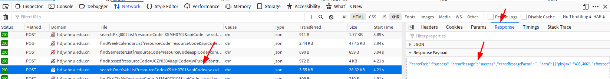

# 湖南大学课程表转ICS
将湖南大学系统教务系统中的 `json` 数据课表转化为 `ics` 格式，方便导入手机和系统日历。
## 依赖
依赖 `ics` 包，请自行安装
```
$ pip3 install ics
```
## 使用方法
1. 修改 `sol.py` 中的起始日期，应该为该学期第一周周一的日期
2. 把抓到的 `json` 数据放到 `data.json` 中
3. `python sol.py` 输出在 `out.ics` 中，导入日历软件，完成

带有课表数据的请求长这样：


*也不知道到底有没有湖大的其他同学能看到这个repo……*